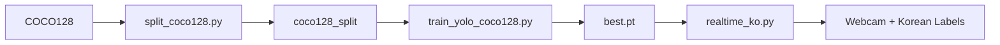

# COCO128 Real-time Object Detection - Hướng dẫn A→Z

## 🎯 Mục tiêu

Xây dựng hệ thống nhận diện đồ vật realtime từ webcam và hiển thị tên tiếng Hàn + romanization.

**Kết quả cuối:**
- ✅ Model YOLO đã train (`best.pt`)
- ✅ Bảng map EN→KO (`labels_ko.json`)
- ✅ Script realtime OpenCV hiển thị chữ Hàn

---

## 📁 Cấu trúc Project

```
korean-topik-learning-app/
├── coco128/                    # Dataset gốc (128 ảnh từ COCO)
│   ├── images/train2017/
│   └── labels/train2017/
├── coco128_split/              # Dataset sau khi split train/val
│   ├── images/
│   │   ├── train/              (~102 ảnh)
│   │   └── val/                (~26 ảnh)
│   └── labels/
│       ├── train/
│       └── val/
├── runs/detect/train/          # Kết quả training
│   └── weights/
│       ├── best.pt             ⭐ Model tốt nhất
│       └── last.pt
├── ai-backend/
│   ├── labels_ko.json          # Mapping EN→KO (80 classes)
│   └── labels_ko_romanization.json
├── split_coco128.py            # Script tách train/val
├── coco128_split.yaml          # YOLO config
├── train_yolo_coco128.py       # Script training
└── realtime_ko.py              # ⭐ Realtime detection với chữ Hàn
```

---

## 🚀 Hướng dẫn từng bước

### ✅ Bước 0: Kiểm tra COCO128 đã có chưa

Bạn đã có folder `coco128/` với cấu trúc:
```
coco128/
  images/train2017/  (128 ảnh .jpg)
  labels/train2017/  (128 file .txt)
```

Nếu chưa có, tải về:
```bash
wget https://github.com/ultralytics/assets/releases/download/v0.0.0/coco128.zip
unzip coco128.zip
```

---

### ✅ Bước 1: Tách dataset train/val

```bash
cd "/home/ngocduy/capstone1 /HANGUL /korean-topik-learning-app"
python split_coco128.py
```

**Kết quả:**
- Tạo folder `coco128_split/` với train (~102 ảnh) và val (~26 ảnh)
- Tỷ lệ: 80% train, 20% val

**Output:**
```
✅ Done!
Dataset saved to: coco128_split
  Train: 102 images, 102 labels
  Val:   26 images, 26 labels
```

---

### ✅ Bước 2: Cài đặt dependencies

```bash
# YOLO framework
pip install ultralytics

# OpenCV cho realtime detection
pip install opencv-python pillow numpy

# Optional: GPU support
pip install torch torchvision --index-url https://download.pytorch.org/whl/cu118
```

---

### ✅ Bước 3: Train model

#### Option A: Training cơ bản (30 epochs)

```bash
python train_yolo_coco128.py --train
```

#### Option B: Training với tùy chỉnh

```bash
# Training 50 epochs
python train_yolo_coco128.py --train --epochs 50

# Dùng YOLOv8 thay vì YOLO11
python train_yolo_coco128.py --train --model yolov8n.pt

# Dùng dataset 80 ảnh
python train_yolo_coco128.py --train --data coco80.yaml
```

**Thời gian:**
- CPU: ~10-20 phút
- GPU: ~3-5 phút

**Kết quả training:**
```
📁 Results saved to: runs/detect/train
📦 Best model: runs/detect/train/weights/best.pt
📈 Validation Results:
   mAP50: 0.4523
   mAP50-95: 0.2891
```

**Lưu ý:** COCO128 chỉ 128 ảnh nên mAP không cao, nhưng đủ để demo pipeline!

---

### ✅ Bước 4: Export model (Optional)

Nếu muốn deploy sang mobile/web:

```bash
# Export sang ONNX (recommended)
python train_yolo_coco128.py --export

# Export nhiều formats
python train_yolo_coco128.py --export --formats onnx tflite torchscript
```

---

### ✅ Bước 5: Chạy realtime detection với tiếng Hàn

```bash
python realtime_ko.py
```

**Tính năng:**
- ✅ Auto-detect Korean font theo OS (Windows/macOS/Linux)
- ✅ Hiển thị tên tiếng Hàn + confidence score
- ✅ Bounding box màu xanh lá
- ✅ Background đen cho text dễ đọc
- ✅ FPS counter

**Controls:**
- `ESC`: Thoát
- `S`: Chụp screenshot

**Output mẫu:**
```
✅ Model loaded successfully!
✅ Loaded 80 Korean label mappings
✅ Using font: C:/Windows/Fonts/malgun.ttf
✅ Camera opened: 640x480

▶️  Press ESC to quit

[Webcam window hiển thị các đồ vật với tên tiếng Hàn]
```

---

## 🎨 Ví dụ detection

Khi scan webcam, bạn sẽ thấy:

```
컵 0.95          (cup với 95% confidence)
노트북 0.89       (laptop với 89% confidence)
휴대전화 0.76     (cell phone với 76% confidence)
```

---

## 🔧 Cấu hình và Tùy chỉnh

### Điều chỉnh Confidence Threshold

Trong `realtime_ko.py`, dòng 73:
```python
CONF_THRESHOLD = 0.35  # Giảm xuống 0.25 để detect nhiều hơn
```

### Thay đổi Camera Resolution

Trong `realtime_ko.py`, dòng 79-80:
```python
CAMERA_WIDTH = 640   # Tăng lên 1280 nếu muốn HD
CAMERA_HEIGHT = 480  # Tăng lên 720 nếu muốn HD
```

### Chọn Model khác

Trong `realtime_ko.py`, dòng 21:
```python
MODEL_PATH = "yolov8n.pt"  # Dùng pretrained model
# Hoặc
MODEL_PATH = "runs/detect/train/weights/best.pt"  # Dùng model vừa train
```

### Tốc độ vs Độ chính xác

| Model | Tốc độ | Độ chính xác | RAM | Khuyến nghị |
|-------|--------|--------------|-----|-------------|
| yolo11n.pt | ⚡⚡⚡ Rất nhanh | ⭐⭐⭐ Tốt | ~50MB | ✅ Realtime |
| yolo11s.pt | ⚡⚡ Nhanh | ⭐⭐⭐⭐ Rất tốt | ~100MB | Cân bằng |
| yolo11m.pt | ⚡ Vừa | ⭐⭐⭐⭐⭐ Xuất sắc | ~200MB | Độ chính xác cao |

---

## 📊 80 Classes COCO (Tiếng Hàn)

<details>
<summary>Xem đầy đủ 80 lớp đồ vật</summary>

### Con người & Động vật
- person (사람), bird (새), cat (고양이), dog (개), horse (말), sheep (양), cow (소), elephant (코끼리), bear (곰), zebra (얼룩말), giraffe (기린)

### Phương tiện
- bicycle (자전거), car (자동차), motorcycle (오토바이), airplane (비행기), bus (버스), train (기차), truck (트럭), boat (배)

### Đồ vật ngoài trời
- traffic light (신호등), fire hydrant (소화전), stop sign (정지 표지판), parking meter (주차 미터기), bench (벤치)

### Đồ dùng cá nhân
- backpack (배낭), umbrella (우산), handbag (핸드백), tie (넥타이), suitcase (여행 가방)

### Thể thao
- frisbee (프리스비), skis (스키), snowboard (스노보드), sports ball (공), kite (연), baseball bat (야구 방망이), baseball glove (야구 글러브), skateboard (스케이트보드), surfboard (서핑보드), tennis racket (테니스 라켓)

### Đồ nhà bếp
- bottle (병), wine glass (와인잔), cup (컵), fork (포크), knife (칼), spoon (숟가락), bowl (그릇)

### Thực phẩm
- banana (바나나), apple (사과), sandwich (샌드위치), orange (오렌지), broccoli (브로콜리), carrot (당근), hot dog (핫도그), pizza (피자), donut (도넛), cake (케이크)

### Nội thất
- chair (의자), couch (소파), potted plant (화분), bed (침대), dining table (식탁), toilet (변기)

### Điện tử
- tv (텔레비전), laptop (노트북), mouse (마우스), remote (리모컨), keyboard (키보드), cell phone (휴대전화), microwave (전자레인지), oven (오븐), toaster (토스터)

### Khác
- sink (싱크대), refrigerator (냉장고), book (책), clock (시계), vase (꽃병), scissors (가위), teddy bear (테디 베어), hair drier (헤어 드라이어), toothbrush (칫솔)

</details>

Xem đầy đủ mapping trong: [`ai-backend/labels_ko.json`](ai-backend/labels_ko.json)

---

## 🐛 Troubleshooting

### ❌ Lỗi: Korean font không hiển thị

**Nguyên nhân:** Không tìm thấy font tiếng Hàn

**Giải pháp:**

<details>
<summary>Windows</summary>

Cài font Malgun Gothic (thường có sẵn):
1. Kiểm tra file có tồn tại: `C:/Windows/Fonts/malgun.ttf`
2. Nếu không có, download và cài: [Nanum Gothic](https://hangeul.naver.com/font)

</details>

<details>
<summary>macOS</summary>

```bash
# Font hệ thống thường có sẵn
ls /System/Library/Fonts/AppleSDGothicNeo.ttc
```

</details>

<details>
<summary>Linux (Ubuntu/Debian)</summary>

```bash
sudo apt install fonts-noto-cjk
# Hoặc
sudo apt install fonts-nanum
```

</details>

---

### ❌ Lỗi: Camera không mở được

```python
❌ Error: Cannot open camera
```

**Giải pháp:**
```python
# Thử camera index khác
cap = cv2.VideoCapture(1)  # Thay vì 0
```

Hoặc test với video file:
```bash
python realtime_ko.py  # Sửa source trong code
```

---

### ❌ Lỗi: Model quá chậm

**Triệu chứng:** FPS < 5

**Giải pháp:**

1. **Giảm resolution:**
```python
IMGSZ = 416  # Thay vì 640
CAMERA_WIDTH = 480
CAMERA_HEIGHT = 360
```

2. **Dùng model nhỏ hơn:**
```bash
python train_yolo_coco128.py --train --model yolo11n.pt
```

3. **Bật GPU (nếu có):**
```bash
# NVIDIA GPU
pip install torch torchvision --index-url https://download.pytorch.org/whl/cu118

# Apple Silicon (M1/M2)
# PyTorch đã hỗ trợ MPS sẵn
```

---

### ❌ Lỗi: mAP quá thấp

```
mAP50-95: 0.1234
```

**Nguyên nhân:** COCO128 chỉ 128 ảnh, không đủ để train tốt

**Giải pháp:**

1. **Tăng epochs:**
```bash
python train_yolo_coco128.py --train --epochs 100
```

2. **Dùng pretrained model:**
```python
# Trong realtime_ko.py
MODEL_PATH = "yolov8n.pt"  # Model pretrained trên COCO full
```

3. **Train trên dataset lớn hơn:**
- COCO full: 118k ảnh
- Hoặc custom dataset của bạn

---

## 🎯 Workflow Tóm tắt



**Lệnh ngắn gọn:**
```bash
# 1. Split dataset
python split_coco128.py

# 2. Train
python train_yolo_coco128.py --train

# 3. Run realtime
python realtime_ko.py
```

---

## 📚 Tài nguyên bổ sung

### Dataset lớn hơn

Nếu muốn train model chính thức:

1. **COCO Full** (118k ảnh):
   ```bash
   # Download script
   bash datasets/coco.sh
   ```

2. **Open Images V7** (subset):
   - [Download](https://storage.googleapis.com/openimages/web/index.html)
   - Filter theo class cần thiết

### Custom dataset

Nếu muốn thêm đồ vật Việt Nam/Hàn Quốc:

1. Thu thập 200-500 ảnh/class
2. Label bằng [Roboflow](https://roboflow.com/) hoặc [LabelImg](https://github.com/heartexlabs/labelImg)
3. Export sang YOLO format
4. Train như bình thường

---

## 🔗 Integration với App

### Backend API (Flask)

Đã có sẵn trong `ai-backend/app.py`:

```bash
cd ai-backend
python app.py
```

API endpoint: `POST http://localhost:5001/detect`

### Frontend (React/Next.js)

```typescript
// Example: app/camera-vocab/page.tsx
const detectObjects = async (imageBase64: string) => {
  const response = await fetch('http://localhost:5001/detect', {
    method: 'POST',
    headers: { 'Content-Type': 'application/json' },
    body: JSON.stringify({ image: imageBase64 })
  });
  
  const result = await response.json();
  // result.objects = [{korean: "컵", confidence: 0.95, bbox: {...}}, ...]
  return result.objects;
};
```

---

## ✅ Checklist hoàn thành

- [x] Tải COCO128
- [x] Split train/val
- [x] Train YOLO model
- [x] Tạo bảng map EN→KO (80 classes)
- [x] Realtime detection OpenCV
- [x] Hiển thị chữ Hàn với font đúng
- [x] Export model (optional)
- [x] Integration với backend API

---

## 📞 Support & Contact

**Issues thường gặp:**
- Check log trong terminal
- Verify file paths trong YAML config
- Đảm bảo camera permissions

**Performance benchmark:**
- CPU i5: ~10-15 FPS
- GPU RTX 3060: ~60+ FPS
- Apple M1: ~30-40 FPS

**Next steps:**
- Deploy lên mobile (TFLite)
- Web deployment (ONNX.js)
- Add more classes (custom training)

---

**📌 Quick Reference:**

```bash
# Full pipeline in 3 commands:
python split_coco128.py
python train_yolo_coco128.py --train
python realtime_ko.py
```

Chúc bạn thành công! 🚀
